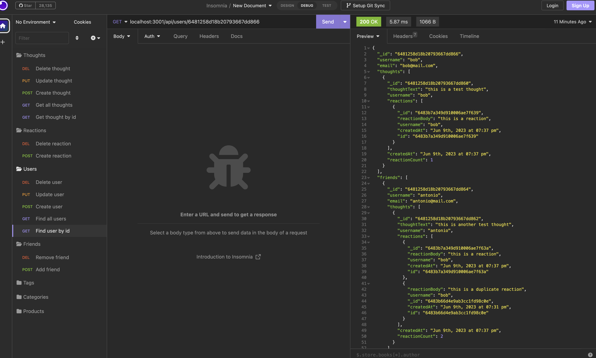

# 18 NoSQL Social Network API

## Description 
For the module 18 assignment I built a social network API in JavaScript. User, thought, reaction and friend data are stored in a MongoDB database. The application uses mongoose to connect to the database and there are API POST, PUT, and DELETE routes for users to create, update, and delete information in the database.

A demo of the tool can be found here: https://drive.google.com/file/d/1YxGDYXLgeX3HrAtYtwpKctBNhavmOrKb/view

## Installation
To install node on mac, use `brew install nvm` and `nvm install 16`.
Use `npm install` to install the mongoose, dotenv, and Express package along with the other required packages.

## Usage
The user will need to seed the database. Use Insomnia Core to create, update, and delete user, thought, reaction and friend information in the database.

## User Story

```
AS A social media startup
I WANT an API for my social network that uses a NoSQL database
SO THAT my website can handle large amounts of unstructured data
```

## Acceptance Criteria 

```
GIVEN a social network API
WHEN I enter the command to invoke the application
THEN my server is started and the Mongoose models are synced to the MongoDB database
WHEN I open API GET routes in Insomnia for users and thoughts
THEN the data for each of these routes is displayed in a formatted JSON
WHEN I test API POST, PUT, and DELETE routes in Insomnia
THEN I am able to successfully create, update, and delete users and thoughts in my database
WHEN I test API POST and DELETE routes in Insomnia
THEN I am able to successfully create and delete reactions to thoughts and add and remove friends to a user’s friend list
```

## Mock-Up

The following image shows the application's appearance and functionality using Insomnia Core:




